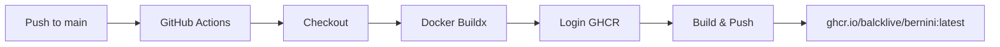

# Bernini 容器化部署指南

## 项目进展

本项目已完成以下容器化工作：

- [x] **Dockerfile** — 基于 `nvidia/cuda:12.6.0-devel-ubuntu22.04`，集成 Python 3.11、PyTorch 2.7.1+cu126、flash-attn、veomni，以及所有推理/训练依赖
- [x] **GitHub Actions CI/CD** — 推送 `main` 分支或 `v*` tag 时自动构建 Docker 镜像并推送至 GHCR
- [x] **FastAPI REST API 服务** — `api_server.py`，提供 `/v1/generate`、`/v1/health`、`/v1/tasks`、`/v1/output` 端点
- [x] **多入口支持** — 同一个镜像可启动 Gradio Web UI、REST API 服务、或命令行推理

---

## 镜像地址

```bash
ghcr.io/balcklive/bernini:latest
ghcr.io/balcklive/bernini:<commit-sha>   # 每次 main 推送自动生成
ghcr.io/balcklive/bernini:<semver>       # git tag v* 推送时生成
```

---

## 启动方式

### 1. Gradio Web UI（默认）

```bash
docker run --gpus all -p 7860:7860 \
  -v /mnt/test:/models \
  ghcr.io/balcklive/bernini:latest \
  python gradio_demo.py --config /models
```

打开浏览器访问 `http://localhost:7860`

### 2. REST API 服务

```bash
docker run --gpus all -p 8000:8000 \
  -v /mnt/test:/models \
  ghcr.io/balcklive/bernini:latest \
  python api_server.py --config /models
```

API 文档：`http://localhost:8000/docs`

#### API 调用示例

**文本生成视频：**
```bash
curl -X POST http://localhost:8000/v1/generate \
  -H "Content-Type: application/json" \
  -d '{"task_type": "t2v", "prompt": "一只猫在公园里散步"}'
```

**视频编辑（上传文件）：**
```bash
curl -X POST http://localhost:8000/v1/generate/upload \
  -F "task_type=v2v" \
  -F "prompt=把场景变成夜晚" \
  -F "video=@input.mp4"
```

**下载结果：**
```bash
curl -o result.mp4 http://localhost:8000/v1/output/<filename>
```

### 3. 命令行推理

```bash
docker run --gpus all --rm \
  -v /mnt/test:/models \
  ghcr.io/balcklive/bernini:latest \
  python infer_single_gpu.py --config /models \
    --task_type t2v --prompt "一只猫在公园散步"
```

---

## 目录结构

```
.
├── Dockerfile                    # 容器镜像构建文件
├── .dockerignore                 # Docker 构建上下文排除规则
├── api_server.py                 # FastAPI REST API 服务
├── gradio_demo.py                # Gradio Web UI
├── infer_single_gpu.py           # 单 GPU 推理入口
├── infer_multi_gpu.py            # 多 GPU 推理入口
├── pyproject.toml                # 项目配置和依赖声明
├── requirements.txt              # pip 依赖锁定
├── .github/workflows/
│   └── build-image.yml           # GitHub Actions CI/CD 流水线
├── bernini/                      # 核心推理/训练代码包
├── configs/                      # 模型配置
├── assets/                       # 演示资源
└── docs/                         # 文档
```

---

## 镜像构建流程



对应文件：`.github/workflows/build-image.yml`

---

## 模型文件组织

宿主机 `/mnt/test` 目录下应存放 Diffusers 格式的模型，与 `ByteDance/Bernini-Diffusers` 结构一致：

```
/mnt/test/
├── transformer/
├── transformer_2/
├── vae/
├── scheduler/
├── tokenizer/
├── text_encoder/
└── model_index.json
```

---

## 常见问题

**Q: 为什么拉取镜像失败？**
A: 首次构建后需要在 GitHub Packages 中将镜像设为 Public：
   `https://github.com/balcklive/Bernini/pkgs/container/bernini` → Settings → Change visibility → Public

**Q: 如何打版本标签？**
```bash
git tag v1.0.0
git push origin v1.0.0
```

**Q: 推送到非 main 分支会触发构建吗？**
A: 不会。只有 push 到 `main` 或推送 `v*` tag 才会触发。

**Q: 镜像构建遇到问题？**
A: 见 Dockerfile 注释和 GitHub Actions 构建日志。常见问题：
- tzdata 交互卡住：已通过 `DEBIAN_FRONTEND=noninteractive` 修复
- flash-attn 编译失败：已通过 `--no-build-isolation` 修复
- setuptools 包发现：已通过 `[tool.setuptools.packages.find]` 配置修复
